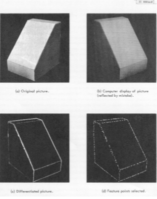
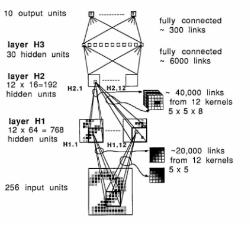
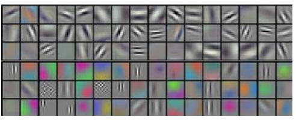
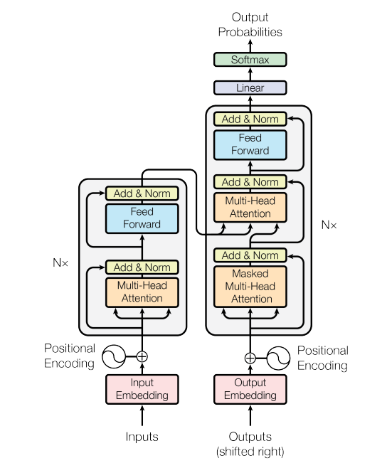
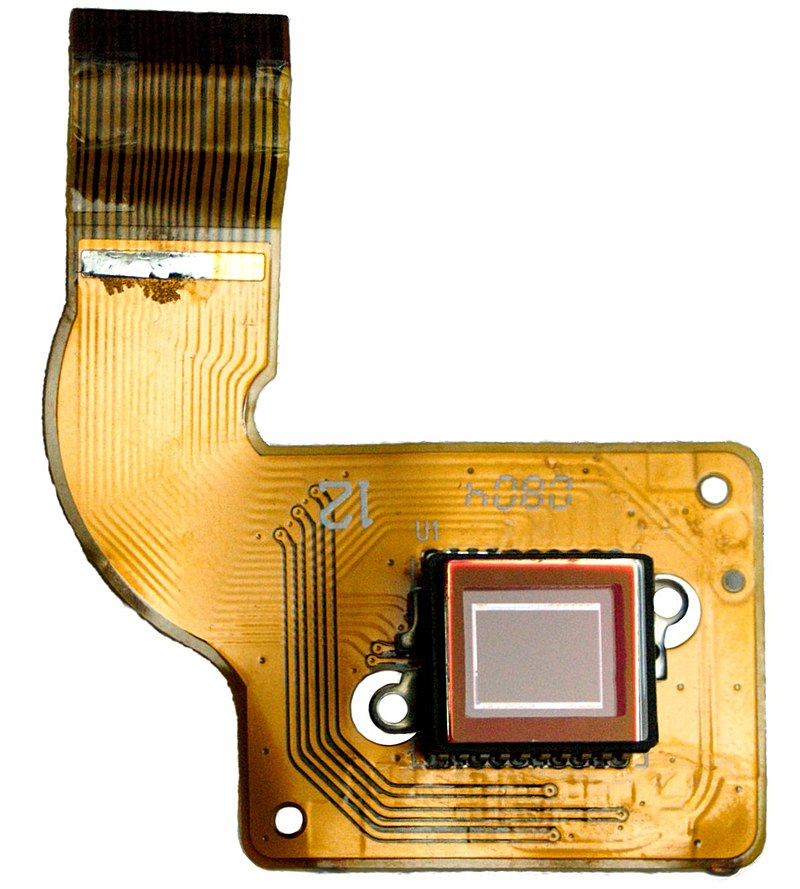
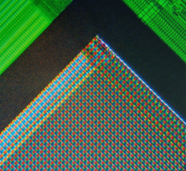
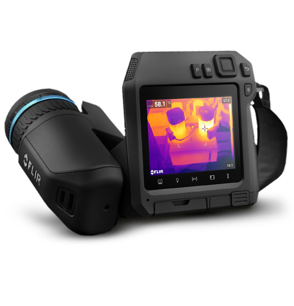
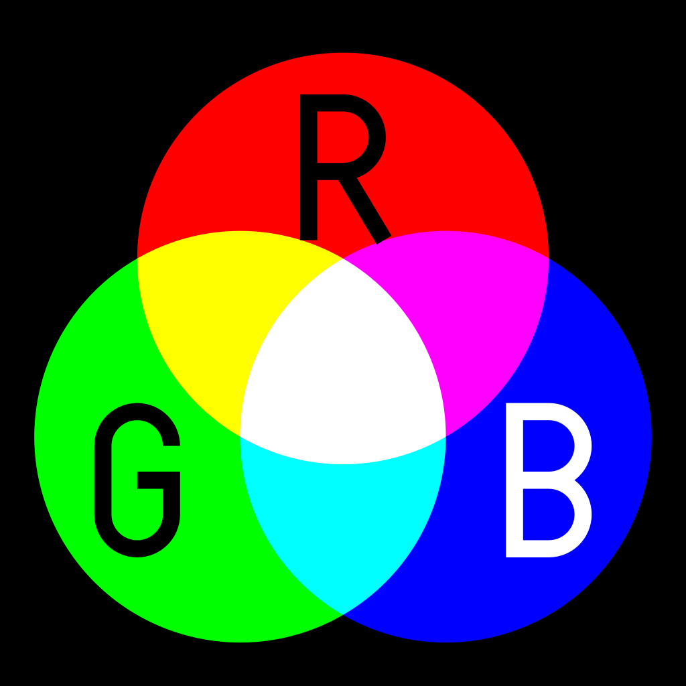
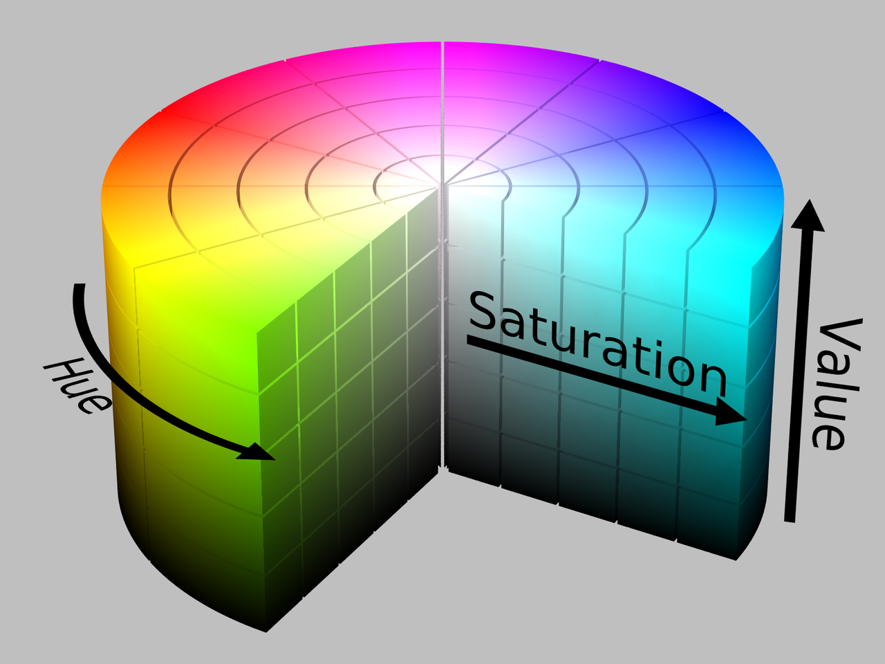

# Visión Computacional
### Tema 1: Fundamentos e Imágenes Digitales

Jose Laruta

Diplomado en Inteligencia Artificial - Unifranz - Mayo 2023

---
# Agenda

1. Introducción a la visión computacional
2. Enfoques de la visión artificial
2. Cámaras digitales y sensores de visión
3. Espacios de color y representaciones

---

# Visión Artificial

Desde el punto de vista ingenieril, el campo de la Visión Artificial intenta emular tareas realizadas por el sistema visual humano. 

El objetivo es lograr **entender** el contenido de una imagen digital en base a distintos algoritmos computacionales.

---

## Hubel y Wiesel (1959)

Realizaron aportes para entender el sistema de visión en mamíferos. Los estímulos visuales provenientes de la retina viajan a la corteza visual y son procesados de forma jerárquica.

---

## Block World (1963)

Larry Roberts describió cómo los **bordes** de los bloques son suficientes para entener la **forma** en 3 dimensiones, independientemente de la orientación.

---

## MIT Summer Vision Project (1966)

El concepto de *Visión Artificial* fue introducido como un **proyecto de verano** en el MIT. Se inición con la definición abstracta de un sistema para el *reconocimiento de patrones*.

---

## Convnets (1989)

Yann LeCun introduce una **Red neuronal convolucional** usada exitosamente para el reconocimiento de dígitos manucritos. Este trabajo fue el precursor de los avances en convnets.

---

## Imagenet (2009)

Fei-Fei Li y sus colegas construyen una masiva base de datos abierta con más de **14 millones de imágenes**. En conjunto, se lanza un concurso anual.

---

## Alexnet (2012)

Alex Krizhevsky, parte del grupo de Geoffrey Hinton en la U. de Toronto, logró entrenar una convnet sobre ImageNet obteniendo un rendimiento ampliamente superior a cualquier otro enfoque hasta entonces.

---

## Transformers (2017)

En el paper "Attention is all you need" se propone una arquitectura basada en mecanismos de "atención" para el procesamiento de secuencias, esto da pie a modelos como gpt3 y SAM.

---

## Enfoques de la Visión Artificial

Existen principalmente dos enfoques en los sistemas de visión artificial modernos:

  - **Enfoque clásico**: Orientado a la ingeniería de características y desarrollo especializado de distintas etapas en un "pipeline".

  - **Enfoque Moderno**: Basado mayormente en el uso de redes neuronales convolucionales para extracción de características y otro tipo de redes neuronales para procesamiento de alto nivel. Orientado a gran cantidad de datos.

---

## Aplicaciones

    - Detección y seguimiento de objetos
    - Odometría Visual
    - Navegación
    - Inspección y control de calidad
    - Fotogrametría
    - Monitoreo y control
    - Registro y segumiento
    - Interacción humano-máquina
    - OCR, digitalización
    - Fotografía digital
    - Industria del entretenimiento
    - Industria militar

--- 

## Cámaras digitales y sensores de visión

Un sensor de visión o imager convierte la atenuación de las ondas de luz que inciden sobre el mismo en señales eléctricas. Este tipo de sensores se usan en cámaras digitales, webcams, mouse óptico y otros.

---

### Cámaras digitales y sensores de visión

 - **CCD**: Basado en arreglos de capacitores, usados en cámaras de alta calidad.
 - **CMOS**: Basados en fotodetectores y transistores, usados en cámaras más baratas y comunes, celulares, webcams.

---

### Separación de color

 - **Bayer filter**: Usa un arreglo de filtros de color.
 - **Foveon X3**: Usa un arreglo de sensores en capas
 - **3CCD**: Usa tres sensores independientes, el color se separa con un prisma.

---

### Sensores especializados

 - Sensores térmicos
 - Sensores hiperespectrales
 - Sensores gamma
 - Sensores de rayos X
 - Sensores de alta sensibilidad

 --- 

 ## Espacios y modelos de color

 Es una representación de la organización de los colores. Se basa en distintos tipos de representaciones y se basa en el uso de un modelo de color para representar el color de forma matemática en forma de tuplas de números.

 ---

 ### RGB

 

 Usa una mezcla aditiva de los tres colores primarios Rojo, Verde y Azul, *Red, Green, Blue*.

 ---
 
 ### CMYK

 
 Usa una mezcla sustractiva, describe el tipo de *tinta* que se necesita aplicar para que el reflejo sobre una superficie blanca genere un color específico.

 ---

### HSV

 
 Representa una manera más natural de representar un color en términos del valor de **hue** y **saturación** que en términos aditivos o sustractivos. Es una transformación del espacio RGB.

---

### 